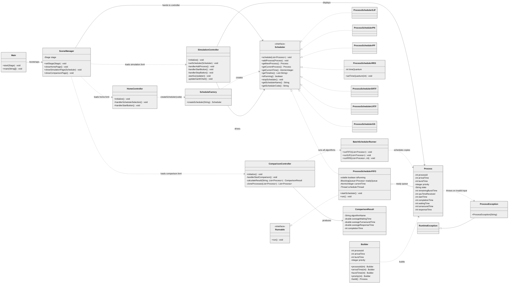
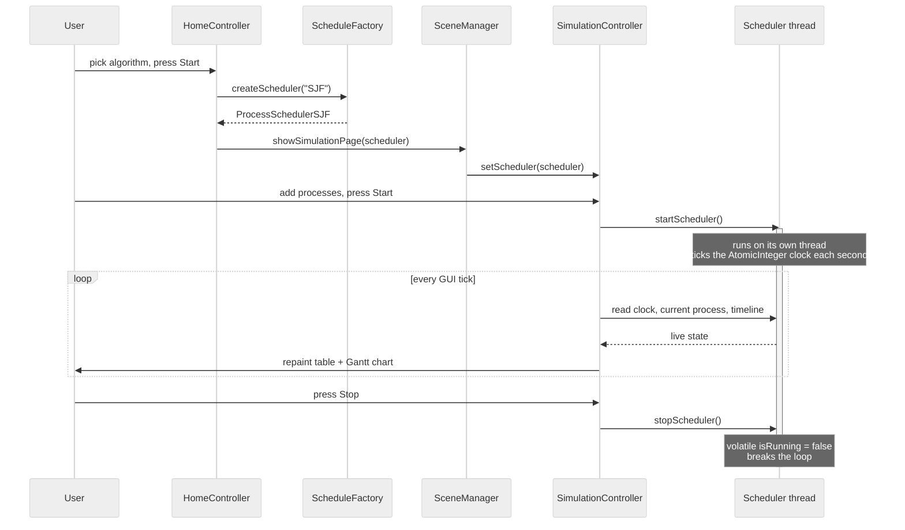

# OS Project — CPU Scheduler Simulator

A JavaFX desktop application that simulates CPU scheduling algorithms in real time.
Processes are scheduled on a live background thread while the GUI shows the ready
queue, the running process, a Gantt chart, and per-process metrics as they are computed.

Made by **Omar Al-Shalabi**.

## Algorithms

| Code   | Algorithm                   | Pre-emptive | Notes |
|--------|-----------------------------|-------------|-------|
| `FIFO` | First In First Out          | No          | In-class |
| `SJF`  | Shortest Job First          | No          | In-class |
| `PN`   | Priority, Non-pre-emptive   | No          | In-class. Priority 0 is highest |
| `PP`   | Priority, Pre-emptive       | Yes         | In-class |
| `RRS`  | Round Robin                 | Yes         | In-class. Requires a positive time quantum |
| `SRTF` | Shortest Remaining Time First | Yes       | Bonus |
| `LRTF` | Longest Remaining Time First  | Yes       | Bonus |
| `GS`   | Guaranteed Scheduling       | Yes         | Bonus. Least CPU time received runs next |

## Running it

### Download the release (Windows, no Java needed)

Grab `OSProject.rar` from the [v1.0.0 release](https://github.com/qCiels/OSProject/releases/tag/v1.0.0),
extract it, and run `OSProject/OSProject.exe`.

This is a `jpackage` bundle: it ships its own Java runtime under `OSProject/runtime/`, so
you do **not** need a JDK, Maven, or JavaFX installed. It is Windows-only — on Linux or
macOS, build from source instead.

### Build from source (any platform)

Requires JDK 24+ and Maven. JavaFX is pulled in as a Maven dependency, so no separate SDK install is needed.

```bash
mvn compile      # build
mvn javafx:run   # launch the GUI
```

## Architecture

The app is built around three patterns:

- **Strategy** — every algorithm implements the `Scheduler` interface, so the GUI drives
  any of them through the same eleven methods without knowing which one it holds.
- **Factory** — `ScheduleFactory.createScheduler("SJF")` maps an algorithm code to a concrete
  scheduler, keeping the `new` calls in one place.
- **Builder** — `Builder` assembles `Process` objects fluently *(legacy; only the retired
  `SimulationClass` demo uses it — the GUI controllers build `Process` directly)*.

Each scheduler is also `Runnable`. `startScheduler()` spawns a named thread that
runs the scheduling loop, advancing an `AtomicInteger` clock one simulated second at a time.
The JavaFX thread polls that shared state on a timer and repaints. The `volatile boolean isRunning`
flag is how the GUI thread signals the scheduler thread to stop — `volatile` guarantees the
worker actually sees the write instead of caching a stale `true` forever.

### Class diagram



> Every `ProcessScheduler*` class implements both `Scheduler` and `Runnable` and owns its own
> ready queue, clock, and thread. Only `ProcessSchedulerFIFO` shows its fields above, to keep
> the diagram readable — the others follow the same shape, with `ProcessSchedulerRRS` adding
> a time quantum.

### Simulation flow



## Project layout

```
src/main/java/org/OperatingSystems/
├── Main.java                     entry point, JavaFX Application
├── SceneManager.java             loads FXML, switches scenes
├── HomeController.java           algorithm picker         (home.fxml)
├── SimulationController.java     live simulation view     (simulation.fxml)
├── ComparisonController.java     run-all comparison view  (comparison.fxml)
├── Scheduler.java                strategy interface
├── ScheduleFactory.java          code → scheduler
├── ProcessScheduler*.java        the eight algorithms
├── BatchSchedulerRunner.java     instant (non-threaded) runs for comparison
├── Process.java                  the scheduled unit + its metrics
├── ComparisonResult.java         per-algorithm averages
├── ProcessException.java         invalid process input
├── Builder.java                  legacy, unused by the GUI
└── SimulationClass.java          legacy console demo, unused

src/main/resources/               home.fxml, simulation.fxml, comparison.fxml, icon
```

## License

Released under the [MIT License](LICENSE).
